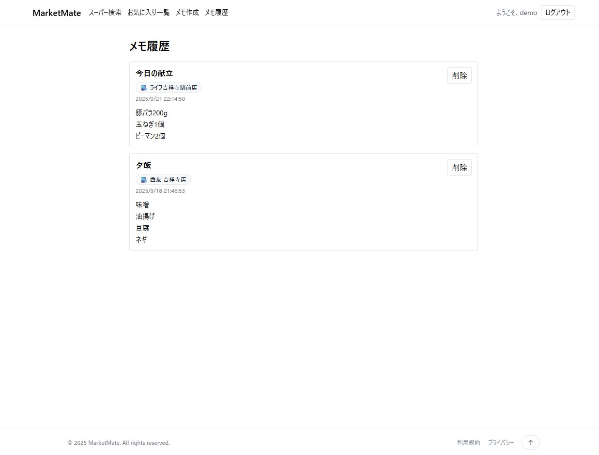

# MarketMate Stack

Nuxt 3（TypeScript）＋ Spring Boot の **モノレポ**。  
駅名・路線名でスーパーを検索し、**営業中/営業時間**の確認、**お気に入り**、**レビュー（詳細画面から）**、**買い物メモ（作成/履歴/削除）** を提供します。

> リポジトリ構成：サーバー `marketmate-server` / フロント `marketmate`

---

## 目次
- [主な機能](#主な機能)
- [技術スタック](#技術スタック)
- [画面イメージ](#画面イメージ)
- [ローカル実行](#ローカル実行)
- [デプロイ](#デプロイ)
- [ライセンス](#ライセンス)

---  

## 主な機能
- **スーパー検索**：（Google Places API）＋ **Google マップ表示**
- **詳細パネル**：営業中ステータス・営業時間・地図・レビュー一覧
- **お気に入り**：★トグルで登録/解除
- **レビュー**：5 段階評価＋コメント、**詳細画面から投稿**
- **買い物メモ**：お気に入り店舗を基点に**作成**（1 行=1 品）、**履歴表示/削除**

---

## 技術スタック

### バックエンド
- **言語/基盤**: Java 21 / Spring Boot 3.x（Gradle）
- **DB**: PostgreSQL  
  - 開発: Docker コンテナ  
  - 本番: **Amazon RDS for PostgreSQL**
- **マイグレーション**: **Flyway**（`Vxxx__*.sql`）
- **API 設計**: REST/JSON、環境別 CORS/設定（dev/prod）
- **認証/認可**: **JWT + Cookie**（`credentials: include` を前提）
- **ロギング/例外**: 統一ハンドラでエラー整形・必要箇所をログ出力
- **テスト**: JUnit 5 / Mockito / MockMvc / **Testcontainers(PostgreSQL)**

### フロントエンド
- **技術**: Nuxt 3（Vue 3, Composition API）, TypeScript, Vite, **Tailwind CSS**, ESLint, Prettier
- **API 方針**
  - **Google Maps / Places API** … **フロントから直接**呼び出し
  - **認証/お気に入り/レビュー/メモ** … **サーバー API** 経由

---

## 画面イメージ

- 検索

<table border="1" cellspacing="0" cellpadding="0"><tr><td>
  
</td></tr></table>

- 詳細＋レビュー

<table border="1" cellspacing="0" cellpadding="0"><tr><td>
  
</td></tr></table>

- お気に入り

<table border="1" cellspacing="0" cellpadding="0"><tr><td>
  
</td></tr></table>

- 買い物メモ作成

<table border="1" cellspacing="0" cellpadding="0"><tr><td>
  
</td></tr></table>

- メモ履歴

<table border="1" cellspacing="0" cellpadding="0"><tr><td>
  
</td></tr></table>

---

## ローカル実行

前提: Node.js 20+ / Java 21+ / Docker

### A. Docker で一括起動
```bash
docker compose up --build
# Web: http://localhost:3000
# API: http://localhost:8080
# DB : localhost:5432 (postgres)
```

---

## デプロイ

本番は **AWS Lightsail コンテナサービス**を利用しています。  
サービス名: **marketmate-web**（Nuxt） / **marketmate-api**（Spring Boot）  
データベース: **Amazon RDS for PostgreSQL**

### 前提
- AWS CLI 設定済み（`aws configure`）・Docker 利用可
- Lightsail で `marketmate-web` / `marketmate-api` のサービスを作成済み
- RDS の接続情報は Lightsail 側の環境変数に保存

---

### 1) イメージをビルド（ローカル）
```bash
# Web (Nuxt)
docker build -t marketmate-web -f marketmate/Dockerfile marketmate

# API (Spring Boot)
docker build -t marketmate-api -f marketmate-server/Dockerfile marketmate-server
```

### 2) Lightsail へイメージをプッシュ（ラベル＝バージョン）

```bash
LABEL=$(date +%Y%m%d%H%M)  # 例: 202509211230

aws lightsail push-container-image \
  --service-name marketmate-web \
  --image marketmate-web \
  --label web-$LABEL

aws lightsail push-container-image \
  --service-name marketmate-api \
  --image marketmate-api \
  --label api-$LABEL
```

### 3) コンソールでデプロイ

1. Lightsail → コンテナサービス → `marketmate-web`（または `marketmate-api`）を開く  
2. **デプロイ** → **コンテナ**タブを設定  
   - コンテナ名: Web=`web` / API=`api`  
   - イメージ: Web=`:web-<LABEL>` / API=`:api-<LABEL>`  
   - 公開ポート: Web=3000(HTTP) / API=8080(HTTP)  
   - 環境変数（例）  
     - Web:  
       - `NUXT_PUBLIC_API_BASE=https://<APIのURL>`  
       - `NUXT_PUBLIC_GOOGLE_MAPS_API_KEY=<GoogleAPIKey>`  
     - API:  
       - `SPRING_PROFILES_ACTIVE=prod`  
       - `SPRING_DATASOURCE_URL=jdbc:postgresql://<RDSエンドポイント>:5432/<DB名>`  
       - `SPRING_DATASOURCE_USERNAME=<ユーザー名>`  
       - `SPRING_DATASOURCE_PASSWORD=<パスワード>`  
       - `JWT_SECRET=<任意の長い秘密鍵>`
3. **公開エンドポイント**タブ  
   - Web: `web:3000` / Health Check=`/`  
   - API: `api:8080` / Health Check=`/`（Actuator使用時は `/actuator/health`）
4. **保存してデプロイ** → ステータスが *Healthy* になったら完了  
   - 表示された **公開URL** をフロントの `NUXT_PUBLIC_API_BASE` に反映（https 推奨）

> 更新は「新しい `<LABEL>` をプッシュ → イメージを切替えてデプロイ」  
> ロールバックは「過去の `<LABEL>` を選び直してデプロイ」

---

## ライセンス
MIT © 2025 ryostart — 詳細は [LICENSE](./LICENSE) を参照
